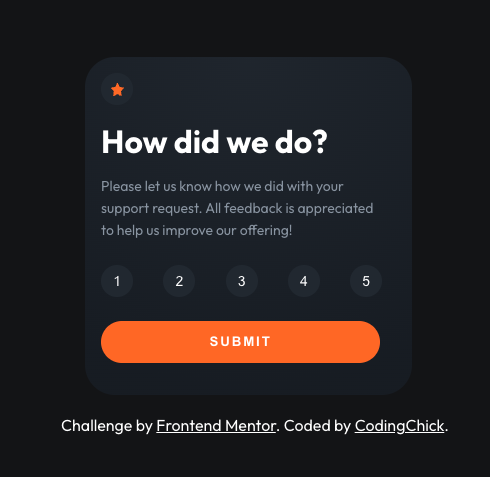
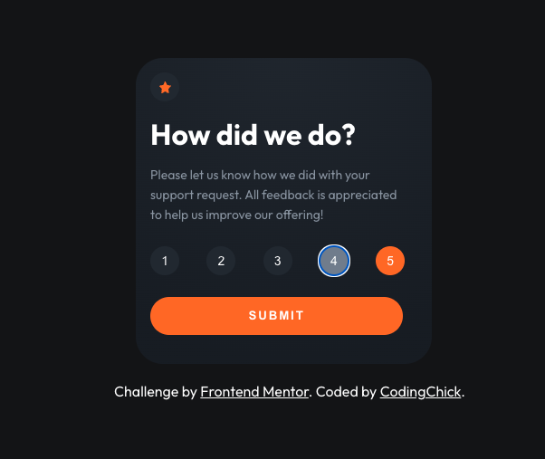

# Frontend Mentor - Interactive rating component solution<!-- omit in toc -->

## Select a rating screen<!-- omit in toc -->



## Rating selection made<!-- omit in toc -->



## Thank you message screen<!-- omit in toc -->


## Table of contents<!-- omit in toc -->

- [How to run the project locally](#how-to-run-the-project-locally)
- [Project commands](#project-commands)
- [Overview](#overview)
  - [The challenge](#the-challenge)
  - [Links](#links)
- [My process](#my-process)
  - [Built with](#built-with)
  - [What I learned](#what-i-learned)
- [`src` component directory structure](#src-component-directory-structure)
- [Useful resources](#useful-resources)
- [Author](#author)

## How to run the project locally

1. Open up the terminal and run `git clone https://github.com/awesomeCoding999/frontend-mentor-interactive-rating-component.git`
2. Run `cd frontend-mentor-interactive-rating-component`
3. Install the dependencies with `yarn`
4. Start with local server with `yarn dev`

## Project commands

- `yarn dev`: starts local server
- `yarn storybook`: starts the local Storybook preview

## Overview

### The challenge

Users should be able to:

- View the optimal layout for the app depending on their device's screen size
- See hover states for all interactive elements on the page
- Select and submit a number rating
- See the "Thank you" card state after submitting a rating

### Links

- [GitHub repo](https://github.com/awesomeCoding999/frontend-mentor-interactive-rating-component)
- [Live site](https://frontend-mentor-interactive-rating-component-eight.vercel.app/)

## My process

### Built with

- [React](https://reactjs.org/)
- [TypeScript](https://www.typescriptlang.org/)
- [Storybook](https://storybook.js.org/)
- [Vite](https://vitejs.dev/)
- Vanilla CSS
- Mobile-first workflow

### What I learned

I learned how to work with [Storybook](https://storybook.js.org/) a little bit better. I added stories to test each of the UI components. I also added the accessibility add on.

```js
import { SelectRatingScreen } from "./SelectRating";
import "./SelectRating.css";

export default {
  title: "Select rating component",
  component: SelectRatingScreen,
};

export const SelectScreen = () => (
  <SelectRatingScreen
    getSelectedRating={function (e: any): void {
      throw new Error("Function not implemented.");
    }}
    selectedRating={null}
    showThankYouScreen={function (): void {
      throw new Error("Function not implemented.");
    }}
  />
);
```

## `src` component directory structure

```
.
├── components
│   ├── card
│   │   ├── Card.css
│   │   ├── Card.tsx
│   │   └── index.ts
│   ├── footer
│   │   ├── Footer.css
│   │   ├── Footer.stories.tsx
│   │   ├── Footer.tsx
│   │   └── index.ts
│   ├── select-rating-screen
│   │   ├── index.ts
│   │   ├── SelectRating.css
│   │   ├── SelectRating.stories.tsx
│   │   └── SelectRating.tsx
│   └── thank-you-screen
│       ├── index.ts
│       ├── ThankYou.css
│       ├── ThankYou.stories.tsx
│       └── ThankYou.tsx
```

## Useful resources

- [Storybook](https://storybook.js.org/) - I relied on the docs on how to setup each of the stories and properly display them in the preview.

## Author

- Frontend Mentor - [@awesomeCoding999](https://www.frontendmentor.io/profile/awesomeCoding999)
